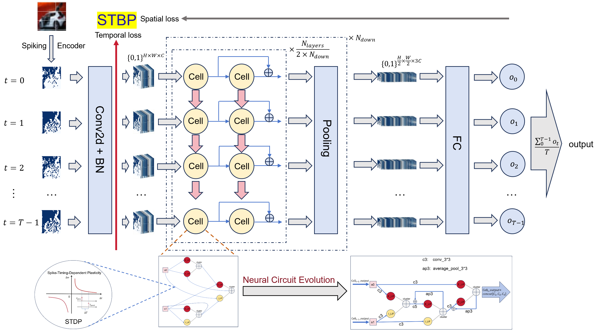

# STDP-Dit-NeuEvo

**Figure:** **A.**  Neural circuit evolution algorithm framework based on STDP rules

**Figure:** **B.** Example of a neuron cluster containing only one excitatory neuron and one inhibitory neuron, performing a secondary integration operation on the additive behavior of the neuron cluster
**Figure:** **C.** The effect of bilinear coefficients was verified under a model with 8 Cell layers, 4 time steps, and 10M parameters, and it was found that the performance was improved on both static data sets and neuromorphic data sets. What’s interesting is that all initial values ​​of k_bilinear are set to 0.1. After training, kEE is stable around 0.2, kII is stable at 0.01fujin, and KEI is stable around 0.25.

